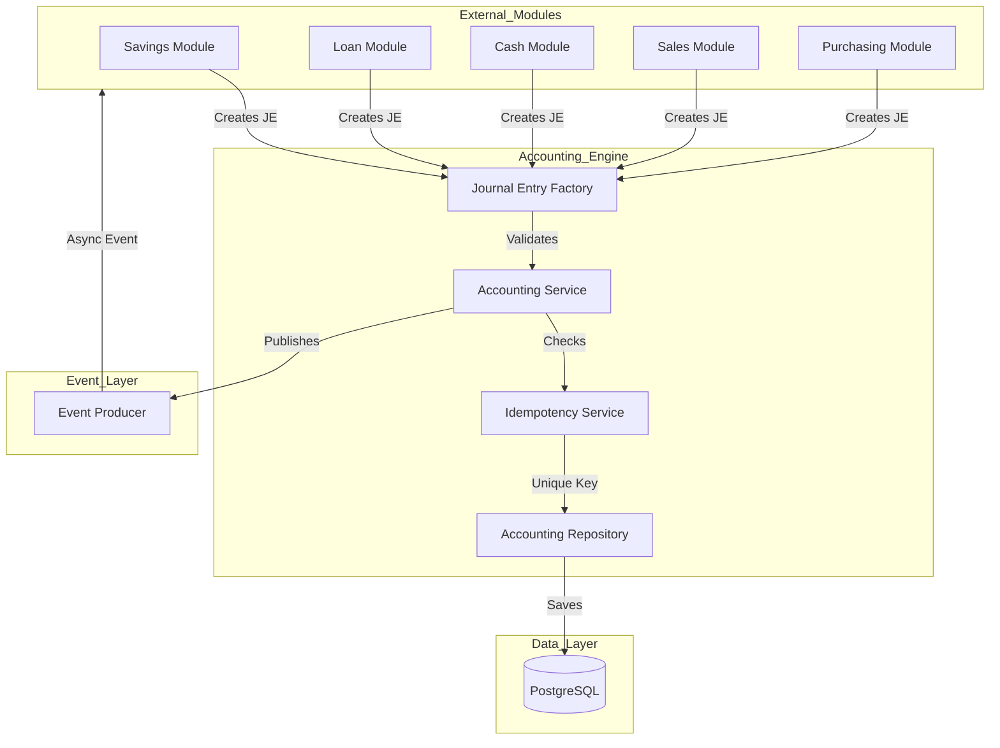
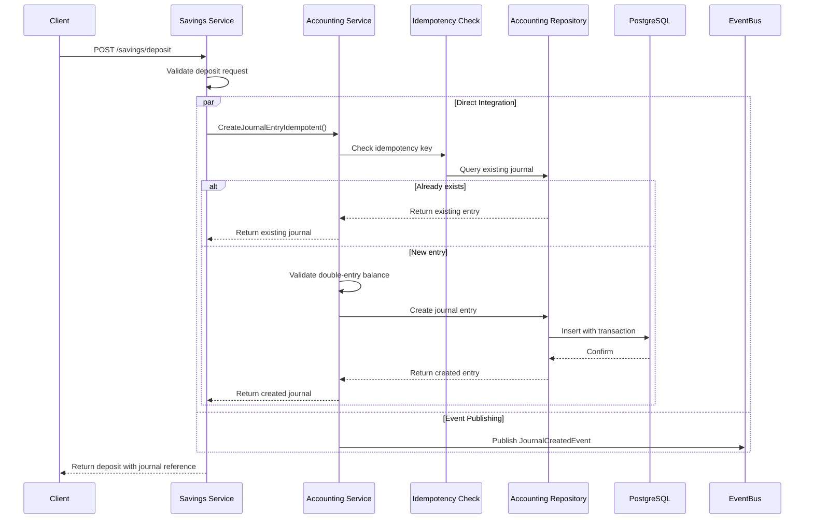
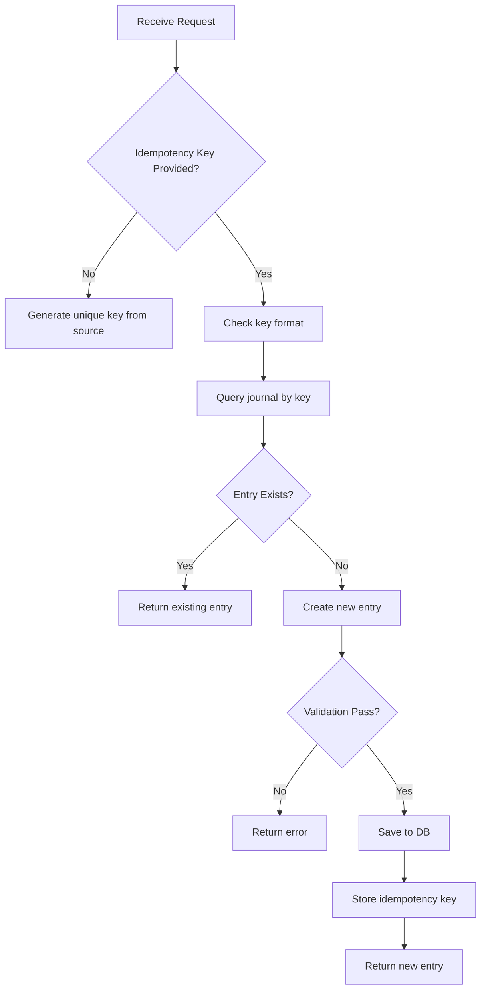
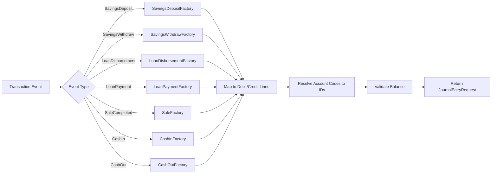
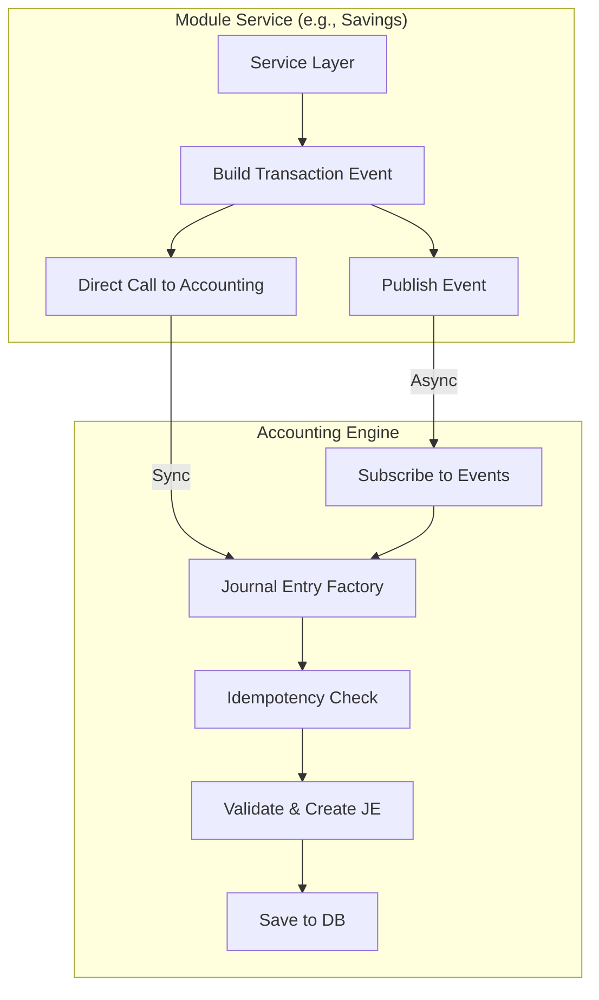

# Accounting Engine Design - Cooperativa SaaS

> **Document Version:** 1.0  
> **Last Updated:** 2026-03-17  
> **Status:** Architecture Specification

---

## 1. Executive Summary

This document outlines the design for a robust accounting engine that:

- Enforces double-entry bookkeeping for all financial transactions
- Provides reusable interfaces for cross-module integration
- Ensures idempotency to prevent duplicate journal entries
- Supports both synchronous (direct calls) and asynchronous (event-driven) patterns

---

## 2. Architecture Overview

### 2.1 Design Principles

1. **Immutability**: Journal entries are never modified after creation; reversals create offsetting entries
2. **Idempotency**: Duplicate requests with same idempotency key produce same journal entry
3. **Atomicity**: Journal creation is atomic with the triggering transaction
4. **Auditability**: Every journal entry links to its source transaction
5. **Reusability**: Generic interfaces allow any module to create journal entries

### 2.2 High-Level Architecture



---

## 3. Service Structure

### 3.1 Core Interfaces

#### 3.1.1 Accounting Service Interface

```go
package accounting

// AccountingService defines the core accounting operations
type AccountingService interface {
    // Synchronous journal entry creation (immediate consistency)
    CreateJournalEntry(ctx context.Context, orgID uint, req *JournalEntryRequest) (*JournalEntryResponse, error)

    // Idempotent journal entry creation
    CreateJournalEntryIdempotent(ctx context.Context, orgID uint, idempotencyKey string, req *JournalEntryRequest) (*JournalEntryResponse, error)

    // Reverse a journal entry (creates offsetting entry)
    ReverseJournalEntry(ctx context.Context, orgID, journalEntryID uint, reason string) (*JournalEntryResponse, error)

    // Get journal entry by ID
    GetJournalEntry(ctx context.Context, orgID, id uint) (*JournalEntryResponse, error)

    // List journal entries with filters
    ListJournalEntries(ctx context.Context, orgID uint, filter JournalEntryFilter) ([]JournalEntryResponse, error)

    // Chart of Accounts operations
    CreateAccount(ctx context.Context, orgID uint, req AccountCreateRequest) (*AccountResponse, error)
    GetAccountByCode(ctx context.Context, orgID uint, code string) (*AccountResponse, error)
    ListAccounts(ctx context.Context, orgID uint, accountType string) ([]AccountResponse, error)
}
```

#### 3.1.2 Journal Entry Factory Interface

```go
package accounting

// JournalEntryFactory creates journal entries for specific transaction types
type JournalEntryFactory interface {
    // CreateJournalEntry generates a journal entry from a transaction event
    CreateJournalEntry(ctx context.Context, orgID uint, event TransactionEvent) (*JournalEntryRequest, error)

    // Returns the event type this factory handles
    SupportedEventType() string
}

// TransactionEvent represents a financial transaction that needs journal entries
type TransactionEvent interface {
    GetEventType() string
    GetOrganizationID() uint
    GetIdempotencyKey() string
    GetTransactionDate() time.Time
    GetAmount() float64
    GetSourceReference() string
    GetSourceModule() string
    GetLines() []JournalLine
}

// JournalLine represents a single debit or credit line
type JournalLine struct {
    AccountCode   string  // Chart of Accounts code (e.g., "1101")
    AccountID     uint    // Optional: Direct account ID lookup
    Debit         float64
    Credit        float64
    Description   string
    PartnerID     *uint   // Optional: Links to member/supplier
    PartnerType   string  // "member", "supplier", "employee"
}
```

### 3.2 Extended Data Models

#### 3.2.1 Enhanced Journal Entry Model

```go
package model

// JournalEntry represents a double-entry accounting transaction block
type JournalEntry struct {
    BaseModel
    TenantModel

    ReferenceNumber    string              `json:"reference_number" gorm:"not null;uniqueIndex"`
    IdempotencyKey     string              `json:"idempotency_key" gorm:"index;uniqueIndex:idx_idemp_org"` // For duplicate prevention
    Date               time.Time           `json:"date" gorm:"type:date;not null"`
    Description        string              `json:"description"`
    Status             string              `json:"status" gorm:"default:'posted'"` // drafted, posted, voided
    SourceModule       string              `json:"source_module"` // savings, loan, cash, sales, purchasing
    SourceReference    string              `json:"source_reference"` // Original transaction ID
    ReversedEntryID    *uint               `json:"reversed_entry_id" gorm:"index"` // Links to reversed entry
    ReversalReason     string              `json:"reversal_reason"` // Reason for reversal
    PostedAt           *time.Time          `json:"posted_at"` // When entry was posted
    PostedBy           *uint               `json:"posted_by" gorm:"index"`

    Lines              []JournalEntryLine `json:"lines" gorm:"foreignKey:JournalEntryID"`
}

// JournalEntryLine represents a single debit or credit line
type JournalEntryLine struct {
    BaseModel
    TenantModel

    JournalEntryID     uint    `json:"journal_entry_id" gorm:"not null;index"`
    AccountID          uint    `json:"account_id" gorm:"not null;index"`
    AccountCode        string  `json:"account_code"` // Denormalized for audit
    Description        string  `json:"description"`
    Debit              float64 `json:"debit" gorm:"type:decimal(15,2);default:0"`
    Credit             float64 `json:"credit" gorm:"type:decimal(15,2);default:0"`
    PartnerID          *uint   `json:"partner_id" gorm:"index"` // Member, supplier, etc.
    PartnerType        string  `json:"partner_type"` // member, supplier, employee
}
```

### 3.3 Request/Response DTOs

#### 3.3.1 Journal Entry Request

```go
package dto

type JournalEntryRequest struct {
    Date             string        `json:"date" validate:"required"`
    Description      string        `json:"description" validate:"required"`
    SourceModule     string        `json:"source_module" validate:"required"`
    SourceReference  string        `json:"source_reference" validate:"required"`
    IdempotencyKey   string        `json:"idempotency_key"` // Optional: for idempotent creation
    Lines            []JournalLineRequest `json:"lines" validate:"required,min=2,dive"`
}

type JournalLineRequest struct {
    AccountCode     string  `json:"account_code" validate:"required"` // Primary: use code
    AccountID       *uint   `json:"account_id"` // Alternative: direct ID
    Description     string  `json:"description"`
    Debit           float64 `json:"debit" validate:"min=0"`
    Credit          float64 `json:"credit" validate:"min=0"`
    PartnerID       *uint   `json:"partner_id"`
    PartnerType     string  `json:"partner_type"`
}
```

#### 3.3.2 Transaction Events (for Event-Driven Integration)

```go
package dto

// SavingsDepositedEvent - when member deposits money
type SavingsDepositedEvent struct {
    OrganizationID    uint      `json:"organization_id"`
    MemberID          uint      `json:"member_id"`
    MemberName        string    `json:"member_name"`
    SavingProductCode string    `json:"saving_product_code"`
    Amount            float64   `json:"amount"`
    TransactionDate   time.Time `json:"transaction_date"`
    ReferenceNumber   string    `json:"reference_number"` // TXN-xxx
    IdempotencyKey    string    `json:"idempotency_key"` // savings.deposit.{org}.{member}.{ref}

    // Computed lines for the journal entry
    CashAccountCode  string    `json:"cash_account_code"` // 1101 or 1102
    SavingsAccountCode string  `json:"savings_account_code"` // 2301
}

// SavingsWithdrawnEvent - when member withdraws money
type SavingsWithdrawnEvent struct {
    OrganizationID      uint      `json:"organization_id"`
    MemberID            uint      `json:"member_id"`
    MemberName          string    `json:"member_name"`
    SavingProductCode   string    `json:"saving_product_code"`
    Amount              float64   `json:"amount"`
    TransactionDate     time.Time `json:"transaction_date"`
    ReferenceNumber     string    `json:"reference_number"`
    IdempotencyKey      string    `json:"idempotency_key"`

    CashAccountCode     string    `json:"cash_account_code"`
    SavingsAccountCode string    `json:"savings_account_code"`
}

// LoanDisbursedEvent - when loan is disbursed to member
type LoanDisbursedEvent struct {
    OrganizationID    uint      `json:"organization_id"`
    MemberID          uint      `json:"member_id"`
    MemberName        string    `json:"member_name"`
    LoanNumber        string    `json:"loan_number"`
    PrincipalAmount   float64   `json:"principal_amount"`
    InterestAmount    float64   `json:"interest_amount"` // If charged upfront
    TransactionDate   time.Time `json:"transaction_date"`
    ReferenceNumber   string    `json:"reference_number"`
    IdempotencyKey    string    `json:"idempotency_key"`

    CashAccountCode  string    `json:"cash_account_code"`
    ReceivableCode   string    `json:"receivable_code"` // 1201
    RevenueCode      string    `json:"revenue_code"` // 4102 - admin fee
}

// LoanPaymentReceivedEvent - when member pays installment
type LoanPaymentReceivedEvent struct {
    OrganizationID    uint      `json:"organization_id"`
    MemberID          uint      `json:"member_id"`
    MemberName        string    `json:"member_name"`
    LoanNumber        string    `json:"loan_number"`
    PaymentAmount     float64   `json:"payment_amount"`
    PrincipalPart    float64   `json:"principal_part"`
    InterestPart     float64   `json:"interest_part"`
    TransactionDate   time.Time `json:"transaction_date"`
    ReferenceNumber   string    `json:"reference_number"`
    IdempotencyKey    string    `json:"idempotency_key"`

    CashAccountCode  string    `json:"cash_account_code"`
    ReceivableCode   string    `json:"receivable_code"`
    RevenueCode      string    `json:"revenue_code"` // 4102
}

// CashInEvent - cash received
type CashInEvent struct {
    OrganizationID    uint      `json:"organization_id"`
    RegisterID        uint      `json:"register_id"`
    Amount            float64   `json:"amount"`
    Category          string    `json:"category"` // sales, other_income
    Description       string    `json:"description"`
    TransactionDate   time.Time `json:"transaction_date"`
    ReferenceNumber   string    `json:"reference_number"`
    IdempotencyKey    string    `json:"idempotency_key"`

    CashAccountCode  string    `json:"cash_account_code"`
    RevenueCode      string    `json:"revenue_code"`
}

// CashOutEvent - cash paid out
type CashOutEvent struct {
    OrganizationID    uint      `json:"organization_id"`
    RegisterID        uint      `json:"register_id"`
    Amount            float64   `json:"amount"`
    Category          string    `json:"category"` // expense, purchase
    Description       string    `json:"description"`
    TransactionDate   time.Time `json:"transaction_date"`
    ReferenceNumber   string    `json:"reference_number"`
    IdempotencyKey    string    `json:"idempotency_key"`

    CashAccountCode  string    `json:"cash_account_code"`
    ExpenseCode      string    `json:"expense_code"`
}

// SaleCompletedEvent - sale transaction
type SaleCompletedEvent struct {
    OrganizationID    uint      `json:"organization_id"`
    OrderID           uint      `json:"order_id"`
    OrderNumber       string    `json:"order_number"`
    PaymentMethod     string    `json:"payment_method"` // cash, credit
    Amount            float64   `json:"amount"`
    COGS              float64   `json:"cogs"` // Cost of goods sold
    TransactionDate   time.Time `json:"transaction_date"`
    ReferenceNumber   string    `json:"reference_number"`
    IdempotencyKey    string    `json:"idempotency_key"`

    CashAccountCode  string    `json:"cash_account_code"`
    ReceivableCode   string    `json:"receivable_code"` // If credit
    RevenueCode      string    `json:"revenue_code"` // 4101
    COGSCode         string    `json:"cogs_code"` // 5101
    InventoryCode    string    `json:"inventory_code"` // 1301
}
```

---

## 4. Function Flow

### 4.1 Synchronous Journal Entry Creation



### 4.2 Idempotency Flow



### 4.3 Journal Entry Factory Flow



---

## 5. Input/Output Design

### 5.1 Create Journal Entry - Input

```json
// POST /api/v1/accounting/journal-entries
{
  "date": "2026-03-17",
  "description": "Deposit to savings - Member A001",
  "source_module": "savings",
  "source_reference": "TXN-00001",
  "idempotency_key": "savings.deposit.1.1.TXN-00001",
  "lines": [
    {
      "account_code": "1101",
      "description": "Cash - Main Register",
      "debit": 1000000.0,
      "credit": 0.0,
      "partner_id": 1,
      "partner_type": "member"
    },
    {
      "account_code": "2301",
      "description": "Deposit Anggota - A001",
      "debit": 0.0,
      "credit": 1000000.0,
      "partner_id": 1,
      "partner_type": "member"
    }
  ]
}
```

### 5.2 Create Journal Entry - Output

```json
{
  "id": 1,
  "reference_number": "JE-20260317-00001",
  "date": "2026-03-17",
  "description": "Deposit to savings - Member A001",
  "status": "posted",
  "source_module": "savings",
  "source_reference": "TXN-00001",
  "idempotency_key": "savings.deposit.1.1.TXN-00001",
  "total_debit": 1000000.0,
  "total_credit": 1000000.0,
  "lines": [
    {
      "id": 1,
      "account_id": 1,
      "account_code": "1101",
      "account_name": "Kas Tunai",
      "description": "Cash - Main Register",
      "debit": 1000000.0,
      "credit": 0.0,
      "partner_id": 1,
      "partner_type": "member"
    },
    {
      "id": 2,
      "account_id": 15,
      "account_code": "2301",
      "account_name": "Deposit Anggota",
      "description": "Deposit Anggota - A001",
      "debit": 0.0,
      "credit": 1000000.0,
      "partner_id": 1,
      "partner_type": "member"
    }
  ],
  "created_at": "2026-03-17T10:00:00Z"
}
```

### 5.3 Reverse Journal Entry - Input

```json
// POST /api/v1/accounting/journal-entries/1/reverse
{
  "reason": "Incorrect account mapping"
}
```

### 5.4 Reverse Journal Entry - Output

```json
{
  "id": 2,
  "reference_number": "JE-20260317-00002",
  "date": "2026-03-17",
  "description": "REVERSAL: Deposit to savings - Member A001",
  "status": "posted",
  "source_module": "accounting",
  "source_reference": "JE-20260317-00001",
  "reversed_entry_id": 1,
  "reversal_reason": "Incorrect account mapping",
  "total_debit": 1000000.0,
  "total_credit": 1000000.0,
  "lines": [
    {
      "id": 3,
      "account_id": 15,
      "account_code": "2301",
      "description": "REVERSAL - Deposit Anggota - A001",
      "debit": 1000000.0,
      "credit": 0.0
    },
    {
      "id": 4,
      "account_id": 1,
      "account_code": "1101",
      "description": "REVERSAL - Cash - Main Register",
      "debit": 0.0,
      "credit": 1000000.0
    }
  ],
  "created_at": "2026-03-17T10:05:00Z"
}
```

---

## 6. Idempotency Mechanism

### 6.1 Idempotency Key Structure

The idempotency key follows a predictable pattern:

```
{source_module}.{action}.{organization_id}.{source_id}
```

Examples:

- `savings.deposit.1.123` - Savings deposit for org 1, transaction 123
- `loan.disbursement.1.456` - Loan disbursement for org 1, loan 456
- `loan.payment.1.456.5` - 5th payment for loan 456

### 6.2 Idempotency Implementation

```go
// IdempotencyService interface
type IdempotencyService interface {
    // Check if entry exists for the idempotency key
    GetExistingEntry(ctx context.Context, orgID uint, key string) (*model.JournalEntry, error)

    // Store idempotency key with entry ID
    StoreIdempotencyKey(ctx context.Context, orgID uint, key string, entryID uint) error
}

// In Journal Entry creation
func (s *AccountingService) CreateJournalEntryIdempotent(ctx context.Context, orgID uint, key string, req *JournalEntryRequest) (*JournalEntryResponse, error) {
    // 1. If no key provided, generate one
    if key == "" {
        key = generateIdempotencyKey(req.SourceModule, req.SourceReference)
    }

    // 2. Check for existing entry
    existing, err := s.idempotencySvc.GetExistingEntry(ctx, orgID, key)
    if err == nil && existing != nil {
        // Return existing entry - idempotent behavior
        return s.mapToResponse(existing), nil
    }

    // 3. Create new entry
    entry, err := s.createJournalEntry(ctx, orgID, req)
    if err != nil {
        return nil, err
    }

    // 4. Store idempotency key
    if err := s.idempotencySvc.StoreIdempotencyKey(ctx, orgID, key, entry.ID); err != nil {
        // Log error but don't fail - key can be stored separately
        log.Printf("Failed to store idempotency key: %v", err)
    }

    return entry, nil
}
```

### 6.3 Database Index for Idempotency

```sql
-- Composite index for efficient idempotency lookups
CREATE UNIQUE INDEX idx_journal_idempotency_org
ON journal_entries (organization_id, idempotency_key)
WHERE idempotency_key IS NOT NULL;
```

---

## 7. Reusable Journal Entry Factory

### 7.1 Factory Registry

```go
package accounting

// FactoryRegistry holds all journal entry factories
type FactoryRegistry struct {
    factories map[string]JournalEntryFactory
    mu        sync.RWMutex
}

func NewFactoryRegistry() *FactoryRegistry {
    return &FactoryRegistry{
        factories: make(map[string]JournalEntryFactory),
    }
}

// Register adds a factory for a specific event type
func (r *FactoryRegistry) Register(factory JournalEntryFactory) {
    r.mu.Lock()
    defer r.mu.Unlock()
    r.factories[factory.SupportedEventType()] = factory
}

// GetFactory retrieves a factory by event type
func (r *FactoryRegistry) GetFactory(eventType string) (JournalEntryFactory, error) {
    r.mu.RLock()
    defer r.mu.RUnlock()

    factory, ok := r.factories[eventType]
    if !ok {
        return nil, fmt.Errorf("no factory registered for event type: %s", eventType)
    }
    return factory, nil
}

// CreateJournalEntry creates a journal entry using the appropriate factory
func (r *FactoryRegistry) CreateJournalEntry(ctx context.Context, orgID uint, event TransactionEvent) (*JournalEntryRequest, error) {
    factory, err := r.GetFactory(event.GetEventType())
    if err != nil {
        return nil, err
    }
    return factory.CreateJournalEntry(ctx, orgID, event)
}
```

### 7.2 Example Factory Implementation

```go
package accounting

// SavingsDepositFactory creates journal entries for savings deposits
type SavingsDepositFactory struct{}

func (f *SavingsDepositFactory) SupportedEventType() string {
    return "savings.deposited"
}

func (f *SavingsDepositFactory) CreateJournalEntry(ctx context.Context, orgID uint, event TransactionEvent) (*JournalEntryRequest, error) {
    // Type assert to get specific event data
    savingsEvent, ok := event.(*dto.SavingsDepositedEvent)
    if !ok {
        return nil, errors.New("invalid event type for SavingsDepositFactory")
    }

    // Build journal entry lines
    lines := []JournalLineRequest{
        {
            AccountCode: savingsEvent.CashAccountCode,
            Description: fmt.Sprintf("Cash received from %s", savingsEvent.MemberName),
            Debit:       savingsEvent.Amount,
            Credit:      0,
            PartnerID:   &savingsEvent.MemberID,
            PartnerType: "member",
        },
        {
            AccountCode: savingsEvent.SavingsAccountCode,
            Description: fmt.Sprintf("Savings deposit - %s", savingsEvent.MemberName),
            Debit:       0,
            Credit:      savingsEvent.Amount,
            PartnerID:   &savingsEvent.MemberID,
            PartnerType: "member",
        },
    }

    return &JournalEntryRequest{
        Date:            savingsEvent.TransactionDate.Format("2006-01-02"),
        Description:     fmt.Sprintf("Savings deposit - %s", savingsEvent.ReferenceNumber),
        SourceModule:    "savings",
        SourceReference: savingsEvent.ReferenceNumber,
        IdempotencyKey:  savingsEvent.IdempotencyKey,
        Lines:           lines,
    }, nil
}
```

### 7.3 Pre-registered Factories

```go
// Initialize all factories
func InitializeFactories(reg *FactoryRegistry) {
    reg.Register(&SavingsDepositFactory{})
    reg.Register(&SavingsWithdrawFactory{})
    reg.Register(&LoanDisbursementFactory{})
    reg.Register(&LoanPaymentFactory{})
    reg.Register(&CashInFactory{})
    reg.Register(&CashOutFactory{})
    reg.Register(&SaleFactory{})
    reg.Register(&PurchaseFactory{})
}
```

---

## 8. Event-Driven Integration Pattern

### 8.1 Hybrid Integration Flow



### 8.2 Module Integration Example - Savings Service

```go
package savings

// Enhanced SavingService with accounting integration
type savingService struct {
    repo            repository.SavingRepository
    accountingSvc   accounting.AccountingService  // Direct call
    eventProducer   event.Producer                // Async events
}

func (s *savingService) Deposit(ctx context.Context, orgID uint, req dto.SavingTransactionRequest) (*dto.SavingTransactionResponse, error) {
    // 1. Execute savings transaction (existing logic)
    txn, err := s.executeDeposit(ctx, orgID, req)
    if err != nil {
        return nil, err
    }

    // 2. Build transaction event
    event := &dto.SavingsDepositedEvent{
        OrganizationID:     orgID,
        MemberID:           req.MemberID,
        SavingProductCode:  req.ProductCode,
        Amount:             req.Amount,
        TransactionDate:    time.Now(),
        ReferenceNumber:    txn.ReferenceNumber,
        IdempotencyKey:     fmt.Sprintf("savings.deposit.%d.%d.%s", orgID, req.MemberID, txn.ReferenceNumber),
        CashAccountCode:    "1101", // Get from org settings
        SavingsAccountCode: "2301", // Deposit Anggota
    }

    // 3. Synchronous: Create journal entry directly for immediate consistency
    journalReq := &accounting.JournalEntryRequest{
        Date:           event.TransactionDate.Format("2006-01-02"),
        Description:    fmt.Sprintf("Savings deposit - %s", event.ReferenceNumber),
        SourceModule:   "savings",
        SourceReference: event.ReferenceNumber,
        IdempotencyKey: event.IdempotencyKey,
        Lines: []accounting.JournalLineRequest{
            {
                AccountCode: event.CashAccountCode,
                Debit:       event.Amount,
                PartnerID:   &event.MemberID,
                PartnerType: "member",
            },
            {
                AccountCode: event.SavingsAccountCode,
                Credit:      event.Amount,
                PartnerID:   &event.MemberID,
                PartnerType: "member",
            },
        },
    }

    journal, err := s.accountingSvc.CreateJournalEntryIdempotent(ctx, orgID, event.IdempotencyKey, journalReq)
    if err != nil {
        // Log error but don't fail the transaction
        // Journal can be created manually if needed
        log.Printf("Failed to create journal entry: %v", err)
    }

    // 4. Asynchronous: Publish event for other modules (audit, notifications)
    s.eventProducer.Publish(ctx, event.Event{
        Type:           event.EventSavingsDeposited,
        AggregateID:    txn.ID,
        OrganizationID: orgID,
        Payload:        event,
    })

    // 5. Return transaction with journal reference
    response := s.mapTransactionToResponse(txn)
    response.JournalEntryID = &journal.ID
    response.JournalReference = &journal.ReferenceNumber

    return response, nil
}
```

---

## 9. Standard Journal Entry Templates

### 9.1 Savings Transactions

| Transaction        | Debit Account          | Credit Account         | Description               |
| ------------------ | ---------------------- | ---------------------- | ------------------------- |
| Savings Deposit    | 1101 - Kas Tunai       | 2301 - Deposit Anggota | Member deposits money     |
| Savings Withdrawal | 2301 - Deposit Anggota | 1101 - Kas Tunai       | Member withdraws money    |
| Interest Credited  | 610x - Beban Bunga     | 2301 - Deposit Anggota | Interest added to savings |

### 9.2 Loan Transactions

| Transaction         | Debit Account          | Credit Account          | Description          |
| ------------------- | ---------------------- | ----------------------- | -------------------- |
| Loan Disbursement   | 1201 - Piutang Anggota | 1101 - Kas Tunai        | Loan paid to member  |
| Installment Payment | 1101 - Kas Tunai       | 1201/4102               | Principal + Interest |
| Interest Revenue    | -                      | 4102 - Pendapatan Bunga | Interest portion     |
| Write-off           | 610x - Beban Piutang   | 1201 - Piutang Anggota  | Uncollectible debt   |

### 9.3 Cash Transactions

| Transaction | Debit Account    | Credit Account   | Description    |
| ----------- | ---------------- | ---------------- | -------------- |
| Cash In     | 1101 - Kas Tunai | 4xxx - Revenue   | Money received |
| Cash Out    | 6xxx - Expense   | 1101 - Kas Tunai | Money paid out |

### 9.4 Sales Transactions

| Transaction | Debit Account        | Credit Account    | Description     |
| ----------- | -------------------- | ----------------- | --------------- |
| Cash Sale   | 1101 - Kas Tunai     | 4101 - Pendapatan | Sales revenue   |
| Credit Sale | 1202 - Piutang Usaha | 4101 - Pendapatan | Receivable      |
| COGS Entry  | 5101 - HPP           | 1301 - Persediaan | Cost recognized |

---

## 10. Implementation Checklist

### Phase 1: Core Engine

- [ ] Enhance JournalEntry model with idempotency fields
- [ ] Implement IdempotencyService interface
- [ ] Update AccountingService with idempotent create method
- [ ] Add journal reversal functionality
- [ ] Add account code resolution (code → ID lookup)

### Phase 2: Factory Pattern

- [ ] Create JournalEntryFactory interface
- [ ] Implement FactoryRegistry
- [ ] Create specific factories (Savings, Loan, Cash, Sales)
- [ ] Integrate factory into AccountingService

### Phase 3: Module Integration

- [ ] Update Savings service to call Accounting
- [ ] Update Loan service to call Accounting
- [ ] Update Cash service to call Accounting
- [ ] Update Sales service to call Accounting

### Phase 4: Event Integration

- [ ] Enhance event types with journal entry data
- [ ] Create event subscriber in Accounting
- [ ] Add async event handler for audit trail
- [ ] Configure Kafka topics

### Phase 5: Testing & Validation

- [ ] Unit tests for all factories
- [ ] Idempotency tests
- [ ] Double-entry balance validation tests
- [ ] Integration tests with modules
- [ ] Load testing

---

## 11. File Structure

```
backend/internal/modules/accounting/
├── dto/
│   ├── accounting_dto.go          # Existing DTOs
│   ├── journal_entry_request.go   # Enhanced request DTOs
│   └── transaction_events.go       # Transaction event types
├── model/
│   ├── accounting.go              # Existing models
│   └── journal_entry_extended.go  # Enhanced models
├── repository/
│   ├── accounting_repository.go   # Existing repository
│   └── idempotency_repository.go  # Idempotency queries
├── service/
│   ├── accounting_service.go      # Existing service
│   ├── accounting_service_ext.go  # Enhanced service with idempotency
│   ├── journal_factory.go         # Factory pattern
│   └── factories/
│       ├── savings_factory.go
│       ├── loan_factory.go
│       ├── cash_factory.go
│       └── sales_factory.go
├── event/
│   └── subscriber.go              # Event subscriber
└── seed/
    └── coa_seed.go                # Default CoA data
```

---

## 12. Summary

This accounting engine design provides:

1. **Double-Entry Bookkeeping**: Every transaction creates balanced debit/credit entries
2. **Idempotency**: Duplicate requests with the same key return existing entries
3. **Reusability**: Generic interfaces allow any module to create journal entries
4. **Hybrid Integration**:
   - Synchronous direct calls for immediate consistency
   - Async events for audit and reporting
5. **Audit Trail**: Full traceability from source transaction to journal entry
6. **Reversal Support**: Complete audit trail for corrections

The design follows the existing Go backend patterns and integrates with the established event system.
